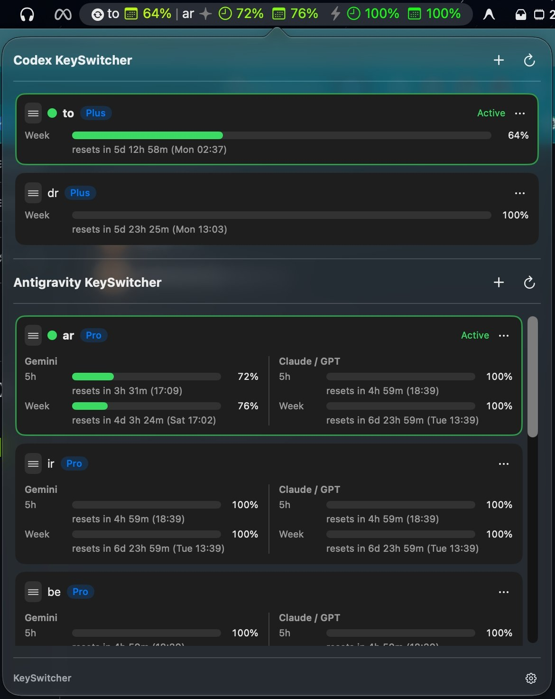

# KeySwitcher

<p align="center">
  <b>A lightweight native switcher and live quota monitor for OpenAI Codex and Google Antigravity (CLI & IDE). macOS menu bar and Windows system tray.</b>
</p>

<p align="center">
  
  
  
  
  
</p>

<p align="center">
  
</p>

---

## Features

- **Single-Click Instant Switching**:
  - **OpenAI Codex**: Swaps token slots, safely persists current token state, performs a graceful restart, and automatically reopens your active conversation thread (`codex://threads/<id>`).
  - **Google Antigravity**: Simultaneously synchronizes authentication across both **CLI** (macOS Keychain) and **IDE** (SQLite storage) with a single action, refreshing stale CLI access tokens before switching.

- **Live Menu Bar Quota Monitor & Visual Customizer**:
  - Real-time remaining percentage and color-coded status badges directly in the macOS menu bar using native SF Symbols.
  - **Codex**: 5-hour window (`clock`) and weekly window (`calendar`).
  - **Antigravity**: Independent breakdowns for **Gemini** (`sparkle`) and **Claude / GPT** (`bolt`) quotas.
  - **Interactive Drag-and-Drop Customizer**: Dedicated settings window to reorder, add, or remove menu bar slots with granular control over **OpenAI Codex**, **Antigravity CLI (Gemini)**, **Antigravity CLI (Claude / GPT)**, **Antigravity IDE (Gemini)**, and **Antigravity IDE (Claude / GPT)**.

- **Unified Dual Dashboard**:
  - Compact side-by-side view showing both Codex and Antigravity accounts simultaneously without tab toggling.
  - Displays plan badges (`Plus`, `Pro`, `Ultra`), visual usage bars, and exact reset countdown timers (e.g. `refresh in 1h 40m (23:54)`).

- **Local & Privacy-Focused**:
  - Zero telemetry, zero external tracking servers.
  - Tokens are stored strictly in local macOS Keychain items and `chmod 600` files.
  - Tap-to-reveal email masking protects account privacy during screencasts.

- **Zero External Dependencies**:
  - Pure native Swift / SwiftUI / AppKit application.
  - Backend engine runs on standard macOS Python 3 (`/usr/bin/python3`) using only the standard library — no `pip`, `venv`, or `node_modules` required.

- **Drag-and-Drop Reordering**:
  - Reorder your accounts by dragging handle bars, with tactile visual feedback and persistent preference storage.

- **Isolated Authentication**:
  - Add new accounts or re-authorize expired sessions inside an isolated browser environment without interrupting your current workflow.

- **Bilingual Localization (English & Russian)**:
  - Automatic system locale detection with instant in-tray language switching (`System`, `English`, `Русский`).

---

## Quick Start

### Installation

Clone the repository and run the automated installer.

**macOS**

```bash
git clone https://github.com/uginy/keySwitcher.git
cd keySwitcher
./install.sh
```

The script compiles the native binary, bundles the engine into `KeySwitcher.app`, signs it with your local development identity, installs it to `/Applications`, and launches the menu bar item.

**Windows**

```powershell
git clone https://github.com/uginy/keySwitcher.git
cd keySwitcher
powershell -ExecutionPolicy Bypass -File .\install.ps1
```

The script copies the Python engine and tray app to `%LOCALAPPDATA%\KeySwitcher`, imports the current Codex session as slot 1 if needed, creates Start Menu / Startup shortcuts, and launches the tray icon. Requires Python 3.9+ on PATH. No `pip` packages.

### Updating

To pull the latest changes and rebuild:

```bash
git pull
./update.sh          # macOS
.\update.ps1         # Windows
```

### Uninstallation

To cleanly remove the application and runtime metadata:

```bash
./uninstall.sh       # macOS
.\uninstall.ps1      # Windows
```
*(Token slots in `~/.codex/accounts/` and Keychain / Credential Manager items are preserved by default).*

---

## Architecture

```
[ macOS Menu Bar | Windows tray ]
       │  (AppKit + SwiftUI  /  Python + Tk + NotifyIcon)
       ▼
 KeySwitcher
       │
       ├──► OpenAI Codex
       │       ├─► Slots:  ~/.codex/accounts/auth_*.json
       │       ├─► Active: ~/.codex/auth.json
       │       └─► API:    chatgpt.com/backend-api/wham/usage
       │
       └──► Google Antigravity
               ├─► CLI:    macOS Keychain / Windows Credential Manager (service=gemini)
               ├─► IDE:    state.vscdb (Application Support on macOS, %APPDATA% on Windows)
               └─► API:    cloudcode-pa.googleapis.com (loadCodeAssist)
```

---

## CLI Reference

The core engine can also be operated directly from the terminal or integrated into custom shell scripts:

### Codex Engine (`engine/keyswitcher.py`)

```bash
# Check status and quota of all Codex accounts
python3 engine/keyswitcher.py status

# Switch to slot 2 (graceful restart + restore active thread)
python3 engine/keyswitcher.py switch 2

# Add a new account via isolated browser login
python3 engine/keyswitcher.py add

# Re-authenticate an expired slot without switching
python3 engine/keyswitcher.py relogin 2

# Cancel a running interactive add/relogin browser login
python3 engine/keyswitcher.py cancel-add

# Remove slot 2
python3 engine/keyswitcher.py delete 2
```

### Antigravity Engine (`engine/antigravity.py`)

```bash
# Check status, accounts, and quota breakdown
python3 engine/antigravity.py status

# Switch account across CLI and IDE (all targets)
python3 engine/antigravity.py switch <profile_id> all

# Switch account for CLI only or IDE only
python3 engine/antigravity.py switch <profile_id> cli
python3 engine/antigravity.py switch <profile_id> ide

# Start OAuth login for a new account
python3 engine/antigravity.py begin-login cli
```

---

## Requirements

- **macOS**: 13.0 (Ventura) or later (Apple Silicon M1-M4 & Intel x86_64).
- **Windows**: 10 or 11, 64-bit. Codex desktop is the Microsoft Store `OpenAI.Codex` app. Antigravity IDE lives in `%LOCALAPPDATA%\Programs\Antigravity`.
- **Xcode Command Line Tools** (macOS only): `xcode-select --install` (for `swiftc`).
- **Python**: 3.9+ (pre-installed on macOS; install from python.org on Windows).
- **Optional (macOS)**: Accessibility permissions for KeySwitcher (`System Settings -> Privacy & Security -> Accessibility`) to enable smooth Codex window reload (`Cmd+R`).

### Windows notes

- The frontend is a Python stdlib tray app (`app/windows/keyswitcher_app.py`), not the Swift menu bar binary.
- Codex desktop restart targets the Microsoft Store `OpenAI.Codex` package only. ChatGPT Classic is left alone.
- Antigravity CLI / vault credentials use Windows Credential Manager instead of the macOS Keychain helper.
- Engine CLI (`engine/keyswitcher.py`, `engine/antigravity.py`) is the same contract as on macOS.

---

## License

This project is licensed under the MIT License — see the [LICENSE](LICENSE) file for details.
